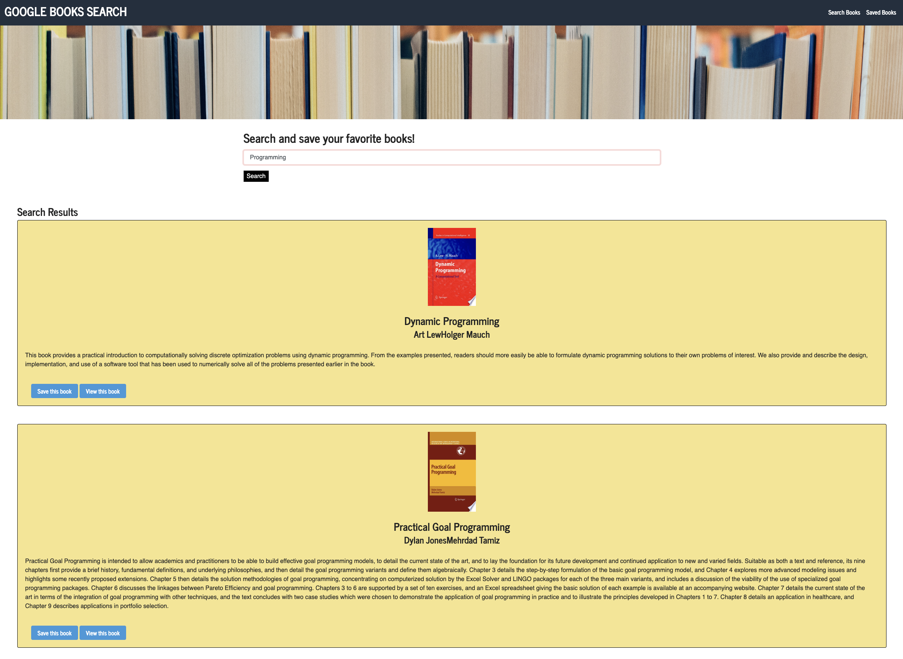
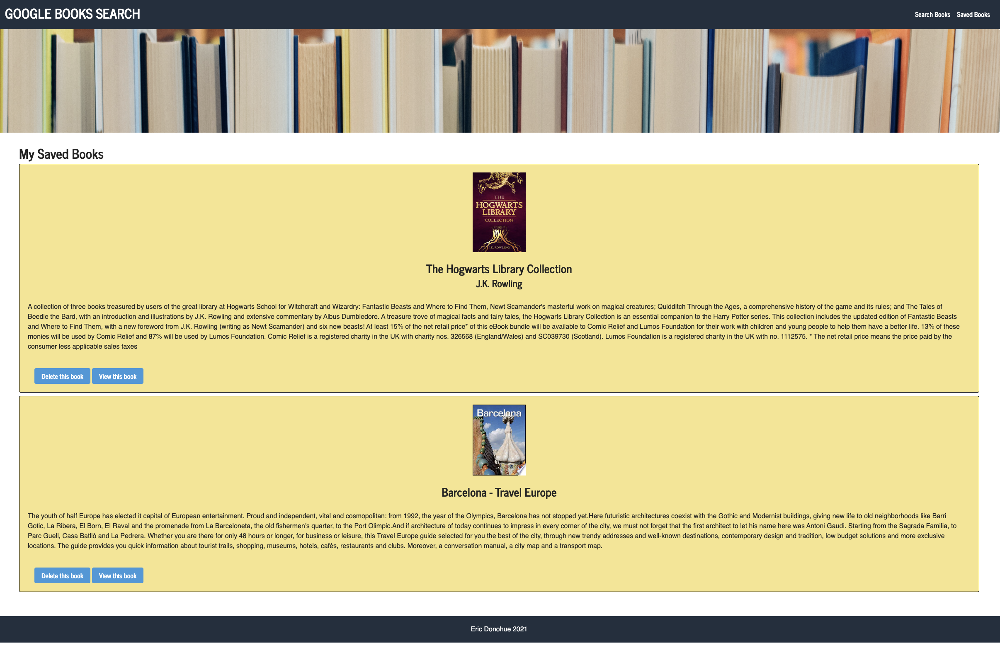

# Google Books Search

## Description
This is a Google Books Search web application.  Search the Google Books database and save your favorite books.  Then, view those books by selecting the 'Saved Books' link on the top-right corner of the website.

This application utilizes ReactJS components, Node and Express JS, MongoDB, and MongoDB Atlas.  The books database information is routed from the Google Books API.  Selecting the 'Save this book' button will save that data in MongoDB if the application is run locally.  On the deployed Heroku site, that information will be saved in MongoDB Atlas. 

## Table of Contents

* [Installation](#installation)

* [Searches](#searches)

* [Deployment](#deployment)

* [Screenshots](#screenshots)

* [Author](#author)

## Installation
To install Node packages, run this terminal command both in the server and client side:
```
npm install
```
To initialize app, run this terminal command on the client side:
```
npm start
```

## Searches
### Search sample suggestions
* Jurassic Park
* Programming
* JavaScript

## Deployment
I have deployed this application on Heroku and connected the database to MongoDB Atlas.

### Heroku Link
[Click here](https://afternoon-chamber-11662.herokuapp.com/)

## Screenshots

* **Searching for Books Page**


* **Saved Books Page**


## Author

* **Eric Donohue**

### Other Projects

Please visit [edonohue8](https://github.com/edonohue8/) to see more of my projects.